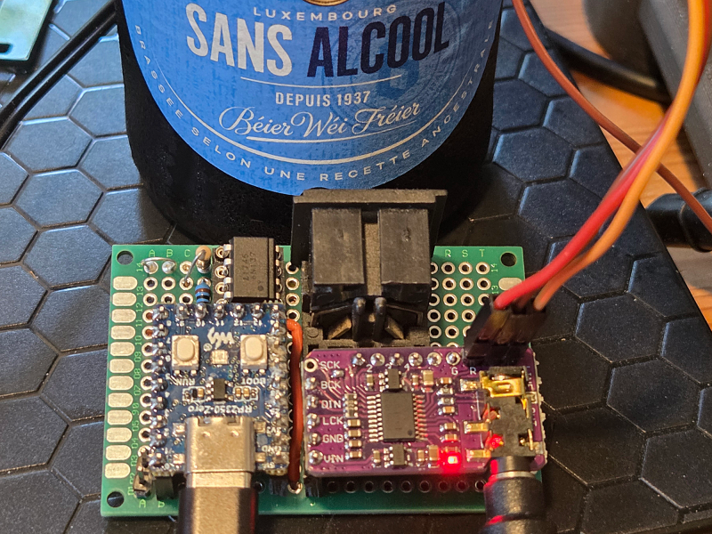
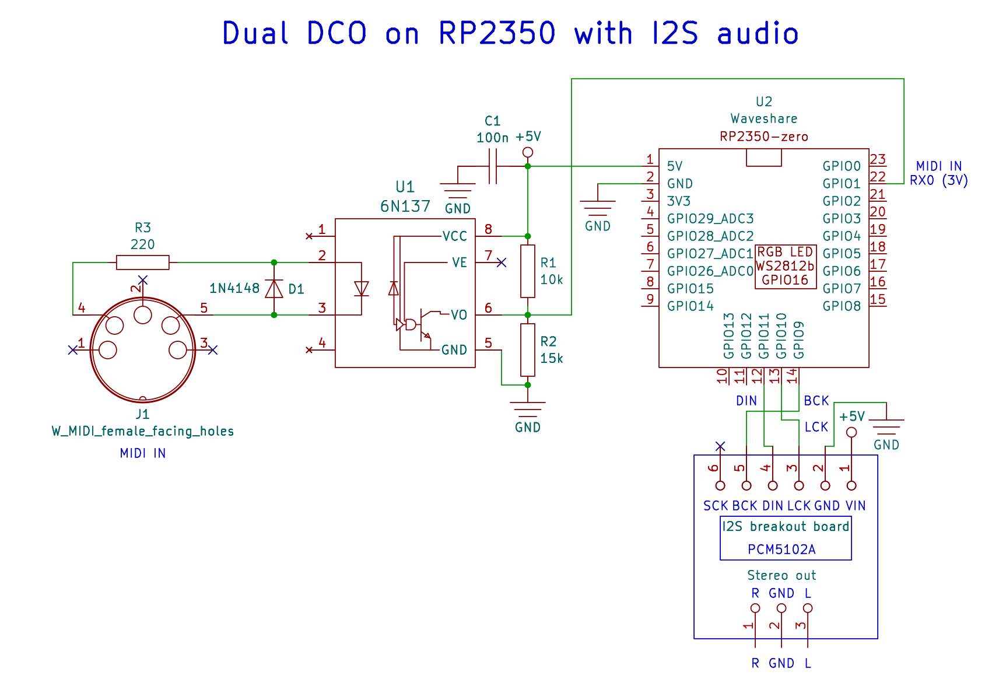

# Dual DCO on RP2350 with I2S audio

I want to better understand how I2S can be used with an RP2350 in C and Micropython after programming it in RISC-V assembler (a book about this will be hopefully published this year :))

On the net I found well structered code from Craig Barnes (Thanks Craig):

https://github.com/craigyjp/Simple-Pico-2-RP2350-based-dual-DCO-with-i2s-Audio

So together with my friend Jean-Claude Feltes we will try to strip the code down to the minimum of two working DCO's.

Circuit:

